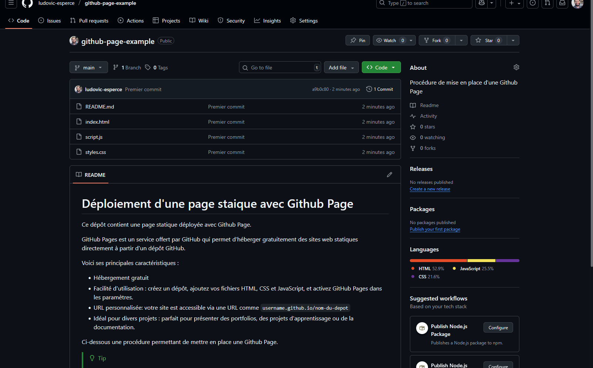
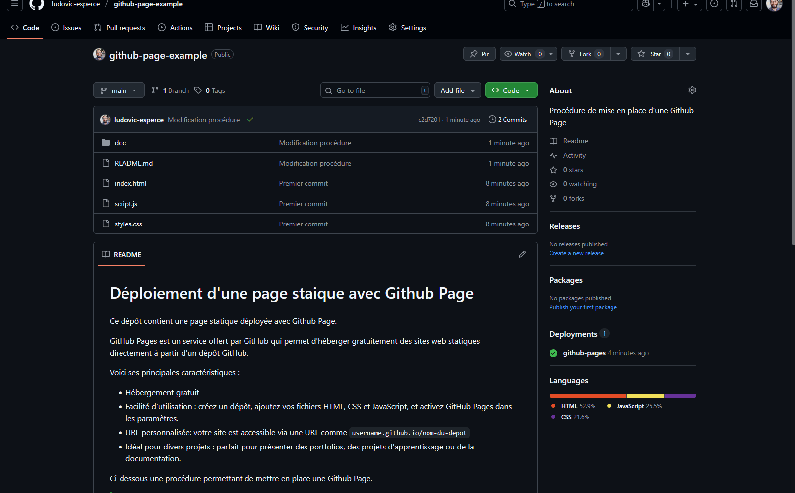

# Déploiement d'une page statique avec Github Page

Ce dépôt contient une page statique déployée avec Github Page.

GitHub Pages est un service offert par GitHub qui permet d'héberger gratuitement des sites web statiques directement à partir d'un dépôt GitHub.

Voici ses principales caractéristiques :
- **Hébergement gratuit**
- **Facilité d'utilisation** : créez un dépôt, ajoutez vos fichiers HTML, CSS et JavaScript, et activez GitHub Pages dans les paramètres.
- **URL automatique** : votre site est accessible via une URL comme `username.github.io/nom-du-depot`
- **Idéal pour divers projets** : parfait pour présenter des portfolios, des projets d'apprentissage ou de la documentation.

Ci-dessous une procédure permettant de mettre en place une Github Page.

> [!TIP]
> Essayez d'appliquer cette procédure à un des sites que vous avez déjà développé.

## Procédure

1. Créer un nouveau dépôt sur Github

2. "Pousser" le code de votre page statique sur ce dépôt.

3. Activer l'option "Github Page" sur votre dépôt comme ci-desous :

4. Accéder à l'URL de votre site :

